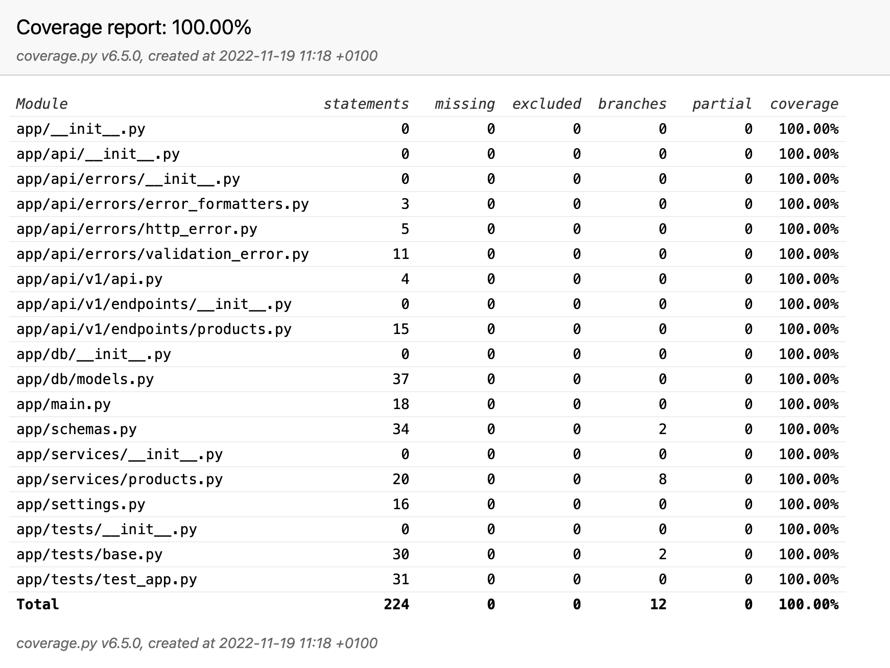

# unbridaled-python-interview

### Installation

Create `.env` files with filled values from `.env.example`. DB URL must be in the following format: `postgresql://{user}:{pass}@{host}/{db_name}`.
Then run migrations:
```shell
python3 cli_manage.py apply-migrations
```

### Run
```shell
python3 cli_manage.py run-app-dev
```

### Run test and create coverage report:
```shell
python3 cli_manage.py get-coverage-report
```

### Additional Features:
- .env configuration
- DB migrations via alembic
- `alembic revision -m ''` supports `--autogenerate`
- separated database for tests with a proper cleaning
- `python3 cli_manage.py` for a better UX


### Code Coverage report
